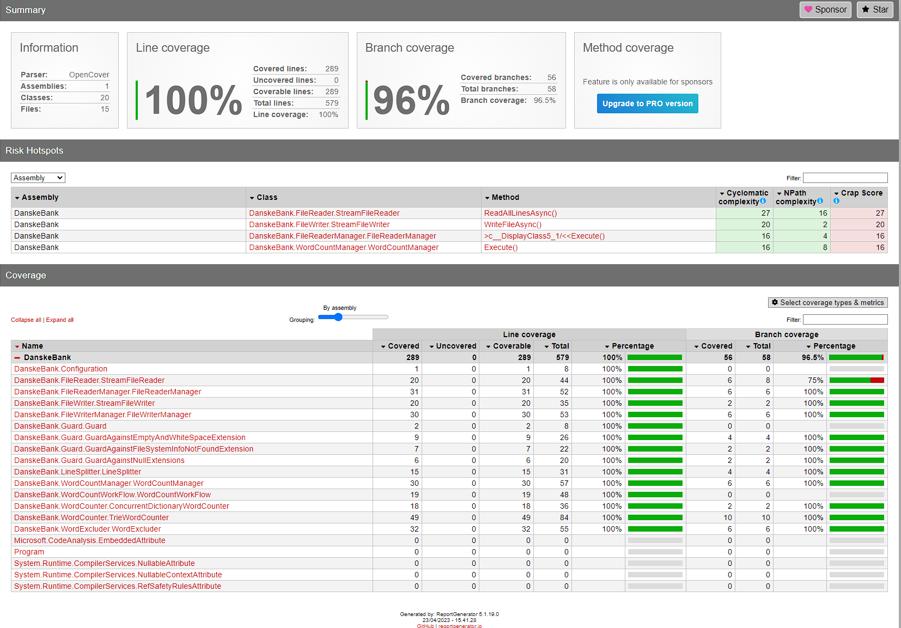
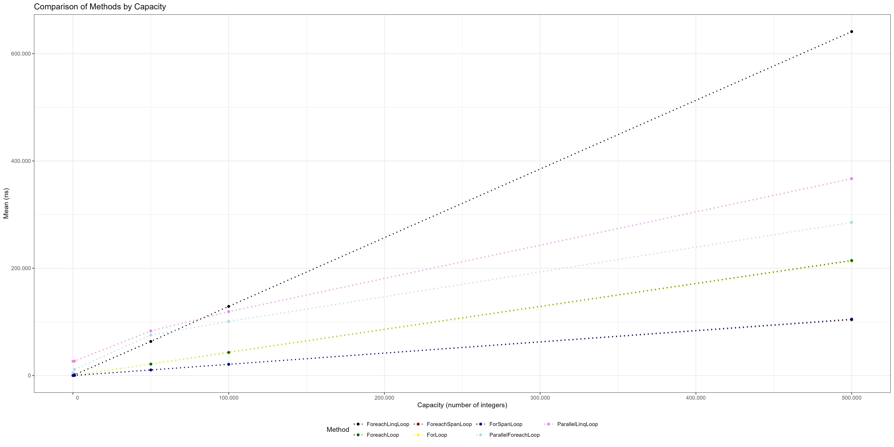
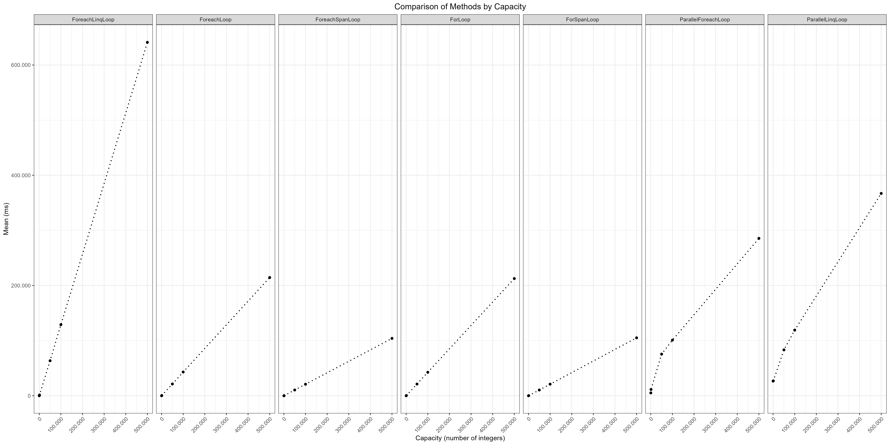
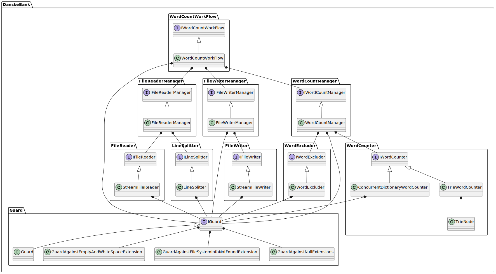
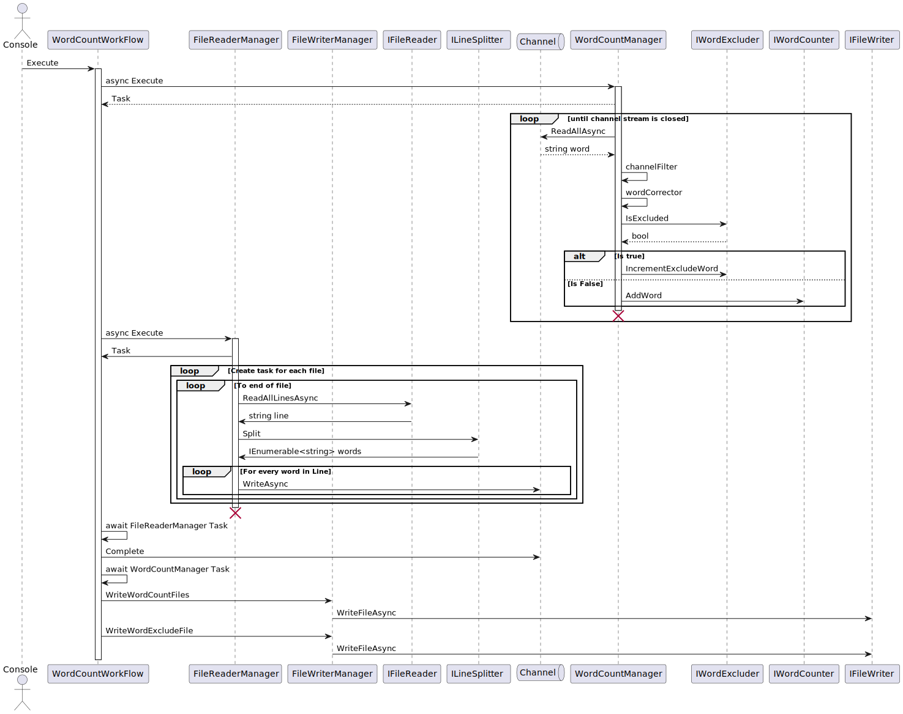

# README

## Test coverage

### Installation
To install AltCover in your test project, run the following command:

```powershell
dotnet add package AltCover
```

To install ReportGenerator globally, use this command:

```powershell
dotnet tool install -g dotnet-reportgenerator-globaltool
```

### Cover code

To run tests and generate XML output, use the following command:

```powershell
dotnet test /p:AltCover=true /p:AltCoverReport=".\altcover.xml" /p:AltCoverAssemblyExcludeFilter='^(?!(DanskeBank)).*$' /p:AltCoverMethodFilter=Main /p:AltCoverFileFilter=Program.cs
```
For more information about AltCover, see the [altcover usage documentation](https://stevegilham.github.io/altcover/Usage.html)

### Generate report 

To generate a report based on AltCover, use the following ReportGenerator command:

```powershell
reportgenerator "-reports:altcover.xml" "-targetdir:./altcover" "-reporttypes:html"
```

For more information, see the [ReportGenerator website](https://reportgenerator.io/) and its [usage](https://reportgenerator.io/usage)

### Summary



The report shows that I achieved 100% line coverage and 96% branch coverage, surpassing my goal of 85%.
The 96% branch coverage is due to the implementation in ```StreamFileReader.cs``` The tests did not cause the variable ```line``` to be null, and the consumer loop did not complete, causing yield not to return all data:

```cs
        string? line;

        while ((line = await reader.ReadLineAsync(cancellationToken)) != null)
        {
            // this is needed because of using a MemoryMappedFile, without it we'll get a line filled with \0
            if (reader.EndOfStream)
            {
                yield break;
            }

            yield return line;
        }
```

A high test coverage offers many benefits, such as reducing the risk of bugs, improving maintainability, and speeding up development. These benefits are measured by the CRAP1 score, as shown in the graph below. The CRAP1 score moves towards the complexity score as the coverage increases.


## Design choices

### Minimize the usage of Linq

While Linq can make C# code more readable, it can also impact performance, as demonstrated in my performance tests. In this assignment, I chose to use ```foreach``` because it offers a good balance between speed, safety, and readability.

The following graphs show the results of the performance tests:




Note:

* Parallel processing can improve performance in heavy workloads, beyond what was demonstrated in the tests.
* The number of iterations is a factor in performance, so choose what best fits your criteria.
* Spans can be extremely fast, but as stated in the documentation: ***"An unsafe class that provides a set of methods to access the underlying data representations of collections."***


To understand why Linq is slower, I used  [sharplab](https://sharplab.io/) to convert high-level C# code to low-level C# code. The native loops remain largely the same when converted, but with Linq, there are significant changes:

Highlevel C#:

```cs
    public void ForLoop()
    {
        for (int i = 0; i < Samples.Count; i++)
        {
            var sample = Samples[i];
        }
    }

    public void ForeachLoop()
    {
        foreach (var sample in Samples)
        {
        }
    }

```

Low level C#:
```cs
    public void ForLoop()
    {
        int num = 0;
        while (num < Samples.Count)
        {
            int num2 = Samples[num];
            num++;
        }
    }

    public void ForeachLoop()
    {
        List<int>.Enumerator enumerator = Samples.GetEnumerator();
        try
        {
            while (enumerator.MoveNext())
            {
                int current = enumerator.Current;
            }
        }
        finally
        {
            ((IDisposable)enumerator).Dispose();
        }
    }

```

In the case of Linq, the simple loop is converted into a class and called with an Action:

```cs
    public void ForeachLinqLoop()
    {
        Samples.ForEach(x => {  });
    } 
```

Low level C#:
```cs

    [Serializable]
    [CompilerGenerated]
    private sealed class <>c
    {
        public static readonly <>c <>9 = new <>c();

        public static Action<int> <>9__1_0;

        internal void <ForeachLinqLoop>b__1_0(int x)
        {
        }
    }

    public void ForeachLinqLoop()
    {
        Samples.ForEach(<>c.<>9__1_0 ?? (<>c.<>9__1_0 = new Action<int>(<>c.<>9.<ForeachLinqLoop>b__1_0)));
    }
```

### Prefer IEnumerable over list  
By returning an ```IEnumerable``` I can take advantage of the ```yield return``` statement. This allows us to generate a sequence of values lazily, producing the next value only when it's requested. This can save memory compared to generating the entire sequence upfront in a List.

However, ```yield return``` has some limitations to keep in mind:

***Parallel processing:***
```yield return``` is not well-suited for scenarios where parallel processing is required, as it may not be able to take advantage of multiple cores or processors. This can result in slower performance when processing large data sets.

***Multiple iterations:***
```yield return``` may not be suitable for scenarios where the same sequence needs to be iterated over multiple times, as values are generated lazily and must be recalculated each time it's iterated over.


***Large data sets:***
```yield return``` can be inefficient when working with large data sets, as values are generated lazily. This can result in slower performance if the data set is large and needs to be processed repeatedly. In such cases, it may be better to generate the entire sequence upfront and store it in memory.

In other words, using ```IEnumerable``` with ```yield return``` can reduce memory consumption at the cost of CPU overhead. However, it's important to consider the limitations and choose the appropriate approach for each scenario.

### Implementation selection based on benchmarks

All of the implementations have been chosen based on benchmarks. Here are the details:

For the ```ILineSplitter``` implementation, I used the built-in ```string.Split``` method because it was the fastest among the options tested. The benchmark results are shown in the table below:

|           Method |     Mean |    Error |   StdDev | Allocated |
|----------------- |---------:|---------:|---------:|----------:|
|   SplitUsingSpan | 60.68 μs | 0.928 μs | 0.823 μs | 937.53 KB |
| SplitUsingString | 59.59 μs | 0.735 μs | 0.652 μs | 781.28 KB |


For the ```IWordCounter``` implementation, I found that a ```ConcurrentDictionary``` was the fastest option (note that a normal ```Dictionary``` with lock is actually faster, but it was not included in the testing). This was a surprising result. The benchmark results for this implementation are shown in the table below:

|           Method | Index |        Mean |     Error |    StdDev |   Allocated |
|----------------- |------ |------------:|----------:|----------:|------------:|
| **DictionaryInsert** |     **0** |    **506.4 μs** |   **4.95 μs** |   **4.39 μs** |    **39.51 KB** |
|       TrieInsert |     0 |    267.0 μs |   1.58 μs |   1.48 μs |   217.39 KB |
| **DictionaryInsert** |     **1** | **14,771.1 μs** | **142.42 μs** | **133.22 μs** |  **8741.06 KB** |
|       TrieInsert |     1 | 40,301.0 μs | 804.64 μs | 752.66 μs | 37032.73 KB |

For the ```IFileWriter``` implementation, I used ```StreamWriter``` combined with foreach and a ```StringBuilder``` since it was the fastest and most memory efficient. The benchmark results are shown in the table below:


|                              Method |     Mean |     Error |    StdDev | Allocated |
|------------------------------------ |---------:|----------:|----------:|----------:|
|                  WriteFileAsyncLinq | 5.351 ms | 0.0953 ms | 0.0892 ms |   4.16 MB |
| WriteFileAsyncForeachReadOnlyMemory | 3.455 ms | 0.0687 ms | 0.0869 ms |   3.07 MB |
|               WriteFileAsyncForeach | 3.413 ms | 0.0680 ms | 0.0908 ms |   3.07 MB |

For the ```IFileReader``` implementation, I used a combination of ```MemoryMappedFile``` and ```treamReader``` because it was the fastest and used less memory than the other implementations. However, there is a small catch - an empty line needs to be added at the end of the files, otherwise it won't return all the data. The benchmark results are shown in the table below:

|                                            Method |     Mean |   Error |  StdDev | Allocated |
|-------------------------------------------------- |---------:|--------:|--------:|----------:|
|                Benchmark_ReadAllLinesAsync_String | 409.2 μs | 2.58 μs | 2.41 μs |  287.6 KB |
| Benchmark_ReadAllLinesAsyncMemoryMappedFileReader | 225.9 μs | 1.18 μs | 1.10 μs | 276.36 KB |
|                  Benchmark_ReadAllLinesAsync_Span | 431.0 μs | 3.85 μs | 3.60 μs | 287.59 KB |

### UML 

The uml is written in puml and exported by running this docker image: ```docker run -d -p 8080:8080 plantuml/plantuml-server:tomcat```

The simplified class diagram is shown below, if you want all the details see the [detailed class diagram](./Diagrams/DetailedClassDiagram.svg)



The program flow can be seen in this sequence diagram:




## Running the program

Getting help:
```powershell
.\DanskeBank.exe -?


Description:
  Word counting utility

Usage:
  DanskeBank [options]

Options:
  -i, --input <input>              Path to the directory, where the input files are located) [default: ./Data]
  -o, --output <output>            Path to the directory, where processed data will be saved [default: ./OutputData]
  -x, --excludefile <excludefile>  Name of the exclude file [default: exclude.txt]
  --version                        Show version information
  -?, -h, --help                   Show help and usage information
```

Run the program with default settings:
```powershell
.\DanskeBank.exe

Unique words: '176 Total count: 37524
Exclude words: '10' Total words excluded: '2476
Words read in total: '40000'
```

Overwrite default settings:
```powershell
.\DanskeBank.exe -i ./Data -o ./Out -x exclude.txt

Unique words: '176 Total count: 37524
Exclude words: '10' Total words excluded: '2476
Words read in total: '40000'
```